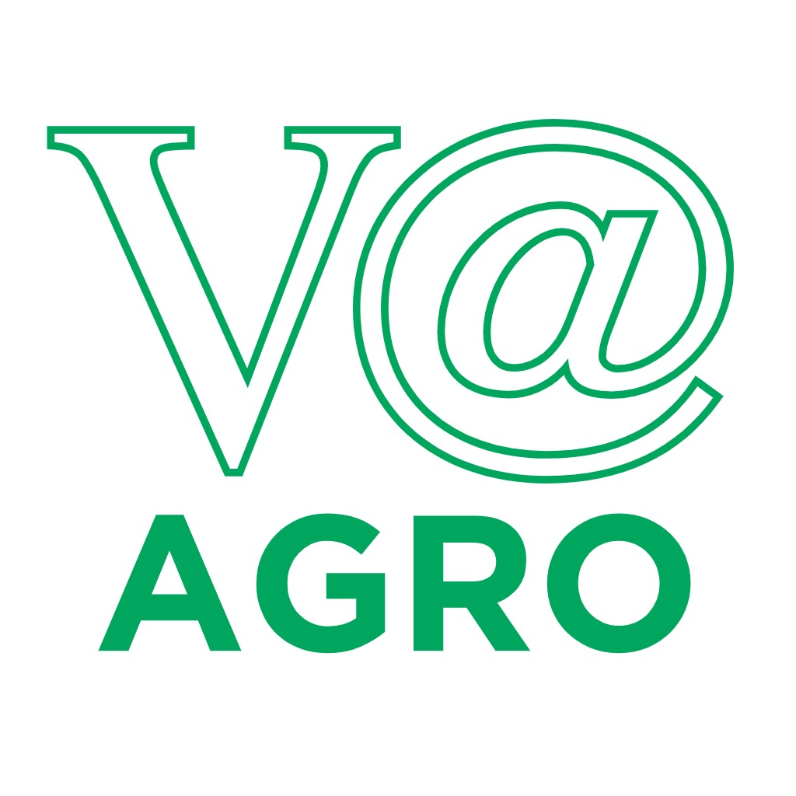

<table>
<tr>
<td>
<a href= "https://www.vistaalegre.agr.br/"> </a>
</td>
<td><a href= "https://www.inteli.edu.br/"></a>
</td>
</tr>
</table>

# Identificação e Monitoramento de Saúde de Bovinos usando Câmeras Termográficas

Este repositório faz parte de um projeto desenvolvido por alunos do Inteli em parceria com a Agropecuária Vista Alegre Ltda., durante o 2º semestre de 2024. O projeto tem como objetivo desenvolver um sistema de deep learning aplicado à visão computacional para monitorar a saúde de bovinos, utilizando câmeras termográficas para medir a temperatura e identificar precocemente possíveis enfermidades no rebanho.

## Empresa: Agropecuária Vista Alegre LTDA

A Agropecuária Vista Alegre, pertencente ao Frigorífico Better Beef localizado na região de Presidente Prudente – SP, atua no segmento de pecuária de corte, tendo como sua operação principal a compra e engorda de bovinos para abate no modelo de confinamento. A Agropecuária Vista Alegre fornece toda sua produção de bovinos para o Frigorífico Better Beef.

## Equipe: _Bullseye_

- [Marcos Teixeira](mailto:Marcos.Teixeira@sou.inteli.edu.br)
- [Raab Iane](mailto:Raab.Silva@sou.inteli.edu.br)
- [Tony Sousa](mailto:Tony.Sousa@sou.inteli.edu.br)
- [Vinicius Kumagai](mailto:Vinicius.Kumagai@sou.inteli.edu.br)
- [Yago Lopes](mailto:Yago.Lopes@sou.inteli.edu.br)

## Descrição do Projeto

Este projeto envolve o processamento de frames de vídeo capturados com câmeras termográficas, anotação de áreas de interesse, e o desenvolvimento de um modelo de IA para análise das imagens resultantes. O objetivo é criar um pipeline eficiente que permita o monitoramento de saúde dos bovinos, identificando sinais precoces de doenças através da análise de temperatura ocular.

### Estrutura de Pastas

- **/codigo**
  - **/app**: Contém o código da aplicação Streamlit para o usuário final, onde é possível fazer o upload dos vídeos e obter os resultados das análises.
  - **/deteccao_cabeca**: Contém o modelo de detecção de cabeças de bovinos em imagens coloridas.
  - **/legado**: Códigos antigos que foram mantidos para referência futura.
  - **/leitura_temperatura**: Contém códigos e scripts relacionados à leitura da temperatura dos bovinos.
  - **/modelo_segmentacao**: Inclui o modelo de segmentação para identificar regiões específicas nas imagens térmicas.
  - **/pipeline**: Contém o código responsável pela sobreposição da imagem colorida na imagem térmica.
  - **/pre_processamento**: Scripts para o pré-processamento dos vídeos e imagens utilizados no projeto.
  - **/tracking**: Códigos para o rastreamento de bovinos em imagens coloridas.
- **/artefatos**: Contém imagens, documentos e outros artefatos gerados durante o desenvolvimento do projeto.

### Pipeline de Dados

1. **Conversão de Vídeos em Frames**:

   - O arquivo `convertor_frames.ipynb` realiza a conversão de vídeos em frames. Os frames são espaçados para garantir a diversidade, evitando a anotação de frames sequenciais.
   - **Configurações Necessárias**:
     - Modifique o caminho do vídeo no script para o local onde está armazenado o vídeo que deseja converter.
     - Este arquivo gera uma série de imagens (frames) a partir do vídeo fornecido.

2. **Processamento e Corte de Imagens**:

   - O arquivo `processamento_cutting.ipynb` processa os frames gerados, aplicando máscaras e recortando áreas de interesse (cabeça dos bovinos), redimensionando as imagens para 128x128 pixels.
   - **Configurações Necessárias**:
     - Modifique o caminho dos arquivos XML gerados pelo CVAT para que o script consiga acessar corretamente as anotações.
     - Modifique o caminho das subpastas com os frames originais.
     - Este arquivo gera novas imagens processadas com as áreas de interesse recortadas, portanto, caso queira, modifique o caminho de output para as imagens geradas.

3. **Organização de Frames:**

   - O arquivo `separacao_frames.ipynb` organiza os frames em pastas, facilitando o gerenciamento dos dados.
   - **Configurações Necessárias**:
     - Defina os caminhos das pastas de origem e destino para organizar os frames conforme a necessidade.
     - Este arquivo reorganiza os frames em uma estrutura de pastas mais adequada para o fluxo de trabalho.

4. **Extração e Agrupamento de Labels:**

   - O arquivo `extracao_agrupamento_labels.ipynb` realiza a extração e o agrupamento dos labels (rótulos) dos frames processados e dos outros grupos de dados. Isso inclui a extração dos dados anotados nos arquivos XML e a organização desses rótulos em um formato mais adequado para treinamento de modelos.

   - **Configurações Necessárias:**
      - Modifique o caminho para as pastas que contêm os arquivos XML e as imagens correspondentes, garantindo que o script possa acessar os dados corretos.
      - Defina o caminho de saída para o arquivo final com os rótulos agrupados.
      - Este arquivo gera um conjunto organizado de labels, - prontos para serem utilizados em modelos de classificação e segmentação.


## Instruções de Processamento

### Processamento individual
Cada um dos modelos e pipelines de processamento pode ser executado de forma independente. As instruções para executar cada parte estão descritas nos respectivos diretórios.

1. **Detecção de Cabeças**: Navegue até a pasta deteccao_cabeca e execute o script principal para detectar cabeças de bovinos em imagens coloridas.
2. **Leitura de Temperatura**: Na pasta leitura_temperatura, siga as instruções para calcular a temperatura dos bovinos com base nas imagens térmicas.
3. **Segmentação**: Para segmentação das imagens, utilize o modelo presente na pasta modelo_segmentacao.
4. **Sobreposição de Imagens**: Utilize o código na pasta pipeline para sobrepor a imagem colorida à imagem térmica.
5. **Rastreamento**: O rastreamento dos bovinos é realizado pelos códigos da pasta tracking.

### Processamento Completo (Usando Streamlit)
Para processar toda a sequência de análise, incluindo upload de vídeos, detecção, segmentação e rastreamento, utilize a aplicação **Streamlit**.

1. Navegue até a pasta app.
2. Execute o comando:
   ```pip install -r requirements.txt```
   Para poder instalar todas as dependências para poder rodar o streamlit.

   Logo após instalar as dependências, execute o próximo comando:
   ```streamlit run app.py```
   Para poder rodar streamlit em um servidor local.
1. Faça o upload dos vídeos e siga as instruções na interface para obter os resultados.

### Dependências
Lista de dependências e suas respectivas versões:
- Python >= 3.8
- Streamlit == 1.3.0
- OpenCV == 4.5.5
- NumPy == 1.21.4
- Torch == 1.10.0
- torchvision == 0.11.1
- TensorFlow == 2.7.0
- EasyOCR == 1.4
- MoviePy == 1.0.3
- Pandas == 1.3.4

### Modelos e Bases de Dados
- **Modelo de Detecção de Cabeças**: `deteccao_cabeca/modelo_deteccao_cabeca_completo.pth`
- **Modelo de Segmentação**: `modelo_segmentacao/modelo_segmentacao.keras`
- **Vídeos Utilizados**: Arquivos de vídeo nos formatos `mp4`, `avi` e `mov`.
- **Arquivos XML**: Configurações e anotações usadas nos modelos (localizados em `data`).

## Guia de Desenvolvimento

Para rodar os arquivos do projeto, siga os passos abaixo:

1. **Clone o repositório:**

   ```bash
   git clone https://github.com/Inteli-College/2024-2A-T05-CC09-G03.git
   cd 2024-2A-T05-CC09-G03/codigo/app/
   ```

2. **Instale as dependências:**

   ```bash
   pip install -r requirements.txt
   ```

3. **Execução dos Arquivos:**
   - **`convertor_frames.ipynb`**: Realiza a conversão dos vídeos em frames. Certifique-se de modificar o caminho para o vídeo que deseja processar. Pode ser executado no VSCode com a extensão Jupyter ou no Google Colab.
   - **`processamento_cutting.ipynb`**: Processa os frames gerados e aplica máscaras para recortar as áreas de interesse. Configure os caminhos dos arquivos XML e execute no VSCode ou Colab.
   - **`separacao_frames.ipynb`**: Organiza os frames em pastas para facilitar o gerenciamento dos dados. Defina os caminhos de origem e destino antes de executar.
   - **`extracao_agrupamento_labels.ipynb`**: Extrai e agrupa os labels dos frames. Verifique os caminhos dos arquivos XML e das imagens.
   - **`deteccao_cabeca.ipynb`**: Contém o modelo de detecção de cabeças de bovinos em imagens coloridas. O script carrega o modelo e faz a detecção das cabeças nos frames de entrada.
   - **`leitura_temperatura.py`**: Lê a imagem de entrada, realiza OCR em regiões de interesse e calcula a temperatura com base no brilho do pixel. Este arquivo pode ser executado diretamente como script Python. Certifique-se de ajustar os caminhos para os frames e as máscaras utilizadas no processo.
   - **`pipeline.py`**: Implementa a sobreposição das imagens coloridas e térmicas, além de rastrear as cabeças dos bovinos e calcular as temperaturas. É necessário ajustar os caminhos dos vídeos coloridos e térmicos, bem como dos modelos carregados. O arquivo também salva vídeos anotados e imagens processadas.
   - **`model_seg.ipynb`**: Utiliza um modelo U-Net para segmentar os olhos dos bovinos nas imagens térmicas. Ajuste os caminhos dos dados de entrada e saída e execute no VSCode ou Google Colab.
   - **`tracking.ipynb`**: Realiza o rastreamento das cabeças dos bovinos em imagens coloridas, permitindo monitorar o movimento dos animais. Verifique e ajuste os caminhos de entrada e saída antes de executar no VSCode ou Google Colab.

### Justificativa das Escolhas

- **Formato PNG**: Optou-se pelo formato PNG devido à sua capacidade de manter a qualidade das imagens sem compressão com perda de dados. Isso é essencial para a análise detalhada em IA, onde cada pixel pode conter informações valiosas.
- **Diversidade das Imagens**: Para garantir a diversidade, foram selecionados frames espaçados no tempo, capturando variações significativas nos cenários e contextos dos vídeos. Isso inclui diversidade de cor dos bois, diferentes temperaturas corporais, variações de posição, iluminação e estado dos bovinos.

### Metodologia de Coleta e Processamento

Os vídeos foram gravados em dias distintos e passaram por uma triagem inicial. Os frames foram extraídos, processados (cropping e redimensionamento), e organizados, garantindo a qualidade e diversidade dos dados. Essa diversidade é crucial para treinar modelos de IA robustos e generalizáveis.

### Garantia da Diversidade

Durante o processo de coleta e processamento, a diversidade foi garantida selecionando frames que capturam diferentes condições de iluminação, cores dos bovinos, temperaturas corporais e posições dos olhos. Isso assegura que o conjunto de dados seja representativo e que o modelo treinado seja capaz de generalizar para diferentes cenários.


## Alterações e Personalizações

Cada um dos arquivos `.ipynb` possui parâmetros e caminhos de arquivos que podem ser personalizados conforme a necessidade do usuário. Abaixo está uma descrição detalhada das alterações possíveis:

### 1. `convertor_frames.ipynb`

Este notebook é responsável por converter os vídeos em frames. Os principais pontos que podem ser personalizados incluem:

- **Caminho do vídeo**: No início do notebook, há uma variável que define o caminho para o vídeo que será processado. Atualize esse caminho para apontar para o vídeo desejado.
  ```python
  video_path = "/caminho/para/o/video.mp4"
  ```

- **Intervalo entre frames**: Para garantir a diversidade dos frames, você pode ajustar o intervalo entre eles. Isso pode ser feito na função de captura de frames.
  ```python
  frame_interval = 30  # Captura um frame a cada 30 frames
  ```

- **Caminho de saída para os frames**: Defina onde os frames extraídos serão salvos.
  ```python
  output_folder = "/caminho/para/salvar/frames"
  ```

### 2. `processamento_cutting.ipynb`

Este notebook processa os frames, aplicando máscaras e recortando áreas de interesse. As principais alterações possíveis incluem:

- **Caminho dos frames**: Defina o caminho onde os frames que serão processados estão armazenados.
  ```python
  frames_folder = "/caminho/para/os/frames"
  ```

- **Caminho dos arquivos XML**: Defina o caminho dos arquivos XML gerados pelo CVAT, que contém as anotações das áreas de interesse.
  ```python
  xml_folder = "/caminho/para/os/xmls"
  ```

- **Parâmetros de recorte e redimensionamento**: Ajuste os parâmetros de recorte e redimensionamento das imagens conforme necessário.
  ```python
  output_size = (128, 128)  # Tamanho das imagens redimensionadas
  ```

- **Caminho de saída das imagens processadas**: Defina onde as imagens processadas serão salvas.
  ```python
  processed_images_folder = "/caminho/para/salvar/imagens/processadas"
  ```

### 3. `separacao_frames.ipynb`

Este notebook organiza os frames em pastas específicas para facilitar o gerenciamento dos dados. As principais alterações incluem:

- **Caminho dos frames**: Defina o caminho onde os frames que serão organizados estão armazenados.
  ```python
  source_folder = "/caminho/para/os/frames"
  ```

- **Caminho de destino das pastas organizadas**: Defina onde os frames organizados serão movidos.
  ```python
  destination_folder = "/caminho/para/salvar/frames/organizados"
  ```

- **Critérios de separação**: Personalize os critérios usados para organizar os frames em diferentes pastas.
  ```python
  criteria = "nome_do_critério"  # Exemplo: "olho_esquerdo" ou "olho_direito"
  ```

### 4. `extracao_agrupamento_labels.ipynb`

Este notebook cuida da extração e agrupamento de labels (rótulos) para o dataset. As personalizações possíveis incluem:

- **Caminho para os arquivos XML**: Defina o caminho onde estão armazenados os arquivos XML que contêm as anotações.
  ```python
  xml_folder = "/caminho/para/seus/arquivos/xml"
  ```

- **Caminho para as imagens associadas aos rótulos**: Defina o caminho para as pastas de imagens que correspondem aos rótulos.
  ```python
  image_folder = "/caminho/para/suas/imagens"
  ```

- **Caminho de saída para os arquivos de rótulos agrupados**: Especifique onde o arquivo final de rótulos agrupados deve ser salvo.
  ```python
  output_folder = "/caminho/para/salvar/labels/agrupados"
  ```

### 5. `model_seg.ipynb`

Este notebook implementa um modelo U-Net para segmentar os olhos dos bovinos nas imagens térmicas. As principais personalizações incluem:

- **Caminho dos dados de treinamento e validação**: Defina o caminho onde estão armazenadas as imagens de entrada e os rótulos (máscaras).
  ```python
  train_image_dir = "/caminho/para/imagens/de/treinamento"
  train_mask_dir = "/caminho/para/mascaras/de/treinamento"
  val_image_dir = "/caminho/para/imagens/de/validacao"
  val_mask_dir = "/caminho/para/mascaras/de/validacao"
  ```

- **Caminho para salvar o modelo treinado**: Defina onde o modelo treinado será salvo.
  ```python
  model_save_path = "/caminho/para/salvar/modelo.h5"
  ```

### 6. `tracking.ipynb`

Este notebook realiza o rastreamento das cabeças dos bovinos em imagens coloridas. As principais personalizações incluem:

- **Caminho dos frames de entrada**: Defina o caminho para os frames que serão utilizados no rastreamento.
  ```python
  input_frames_path = "/caminho/para/frames/de/entrada"
  ```

- **Parâmetros de rastreamento**: Ajuste os parâmetros do algoritmo de rastreamento, como o tipo de rastreador e as configurações específicas para melhorar a precisão.
  ```python
  tracker_type = "CSRT"  # Escolha entre diferentes tipos de rastreadores, como KCF, MIL, GOTURN, etc.
  ```

- **Caminho de saída para o vídeo rastreado**: Defina onde o vídeo final com o rastreamento será salvo.
  ```python
  output_video_path = "/caminho/para/salvar/video_rastreado.mp4"
  ```

# Tutorial
Foi elaborado dois tutoriais em vídeo:
- como rodar a aplicação streamlit;
- como utilizar a aplicação streamlit.

Podemos acessar os tutoriais através do link: [clique aqui](https://drive.google.com/drive/folders/1Q12ONByLqkR4N6BZCCu_6-t7dEP_fVZi?usp=sharing).


## Documentação

O artigo deste projeto está na pasta [/artefatos](/artefatos).

O conteúdo deste artigo foi elaborado como parte das atividades de aprendizado dos alunos, mas precisa ser revisto e modificado caso haja a intenção de submetê-lo para uma eventual publicação.

## Código

Todos os códigos desenvolvidos estão dentro da pasta [/codigo](/codigo).

## Tags

- SPRINT 1:
  - Coleta e Processamento de Imagens de Olhos Bovinos
  - Artigo: Descrição da metodologia da segmentação de imagens dos olhos de bovinos
- SPRINT 2:
  - Implementação de Modelo CNN Próprio - Classificação de Bovinos em Imagens
  - Artigo: Descrição da Metodologia de Implementação
- SPRINT 3:
  - Implementação de Object Detection dos Olhos de Bovinos
  - Artigo: Introdução e Metodologia - Object Detection dos Olhos de Bovinos
- SPRINT 4:
  - Implementação de Image Segmentation
  - Artigo: Refinamento com Image Segmentation
- SPRINT 5:
  - Implementação Final
  - Artigo Final

# Licença

<table>
  <tr></tr>
</table>

<table>
  <tr></tr>
</table>

[Application 4.0 International](https://creativecommons.org/licenses/by/4.0/?ref=chooser-v1)
