# Monitoramento de Bovinos Usando Câmeras Termográficas e Deep Learning: Uma Abordagem Baseada em Visão Computacional

### Abstract

O monitoramento eficaz da saúde dos bovinos em sistemas de confinamento é fundamental para garantir o bem-estar animal e a sustentabilidade econômica da produção pecuária. Este projeto propõe uma abordagem inovadora utilizando câmeras termográficas e modelos de deep learning para identificar precocemente enfermidades em bovinos, com foco na medição da temperatura ocular como indicador de saúde. Os modelos de visão computacional desenvolvidos permitem a análise automática de imagens térmicas, facilitando a detecção de animais com temperaturas anômalas. Os resultados indicam que o uso de termografia combinada com técnicas de machine learning pode ser uma ferramenta poderosa e não invasiva para o monitoramento contínuo da saúde animal, contribuindo para a redução de custos e melhorias na eficiência operacional.

### Introdução

A saúde dos bovinos é essencial para a eficiência e lucratividade na pecuária de corte, especialmente em sistemas de confinamento. Doenças como pneumonia e tuberculose necessitam de detecção precoce para evitar surtos e perdas econômicas significativas. No entanto, os métodos tradicionais de monitoramento são, em sua maioria, invasivos e limitados em eficácia [1].

A termografia infravermelha apresenta-se como uma alternativa promissora e não invasiva, permitindo a medição da temperatura corporal, um indicador crítico para a detecção de enfermidades [2]. Este estudo concentra-se na medição da temperatura interna dos olhos dos bovinos, em vez da temperatura da superfície do couro. A temperatura medida pelo couro é frequentemente imprecisa devido à exposição solar, que aquece a pele de forma constante, enquanto a região ocular reflete com maior precisão a temperatura central do animal, oferecendo um indicador mais confiável para a detecção de febre e doenças [3].

O uso de técnicas de visão computacional e deep learning na análise de imagens termográficas automatiza a detecção de anomalias térmicas, tornando o processo mais ágil e preciso. Além de aprimorar o diagnóstico, essa abordagem reduz o estresse animal e integra-se facilmente aos sistemas de gestão de saúde no confinamento. Essas tecnologias inovadoras não apenas aumentam a eficiência do monitoramento de rebanhos, mas também contribuem para a sustentabilidade da pecuária, otimizando recursos e minimizando impactos ambientais [4][5]. A aplicação de inteligência artificial na pecuária está se consolidando como uma ferramenta crucial para promover a inovação e garantir a sustentabilidade do setor, integrando a saúde animal ao aumento da produtividade [6].

## Metodologia

### Pipeline de Processamento de Dados

O pipeline de processamento de dados desenvolvido neste projeto consiste nas seguintes etapas:

1. **Anotação das Imagens no CVAT**: Após a extração dos frames, as imagens foram carregadas na ferramenta de criação de label CVAT (Computer Vision Annotation Tool), onde foram anotadas as regiões de interesse, incluindo cabeça, olhos e contexto. As labels foram definidas de acordo com a seguinte estrutura:

   - **Cabeça**: Área que contém a cabeça do bovino, preservando detalhes do contexto.
   - **Olho**: Área específica que destaca o olho, essencial para a análise termográfica.
   - **Contexto**: A área ao redor da cabeça, fornecendo informações contextuais.

2. **Processamento e Conversão das Anotações**: A partir de outro código, as anotações em XML foram convertidas em imagens processadas que servem como entradas para o modelo de IA. As imagens processadas foram redimensionadas para 128x128 pixels para garantir uniformidade e eficiência no treinamento do modelo. Para o rótulo (Y) do modelo, as cabeças dos bovinos foram convertidas para a cor branca, e os olhos foram destacados em vermelho, permitindo que o modelo focasse nesses pontos críticos para a análise.

   **Pseudocódigo:**

   ```
   Carregar frames e arquivos XML
   Para cada frame anotado:
       Aplicar máscara de acordo com as coordenadas do XML
       Recortar e redimensionar as áreas de interesse para 128x128pixels
       Converter a cabeça para branco e olhos para vermelho
       Salvar as imagens processadas
   ```

Exemplo de Processamento e Conversão das Anotações:

| Imagem                                                                                                              | Descrição                                                                                                                                           |
| ------------------------------------------------------------------------------------------------------------------- | --------------------------------------------------------------------------------------------------------------------------------------------------- |
| **Figura 1**: Frame Original `<br>` 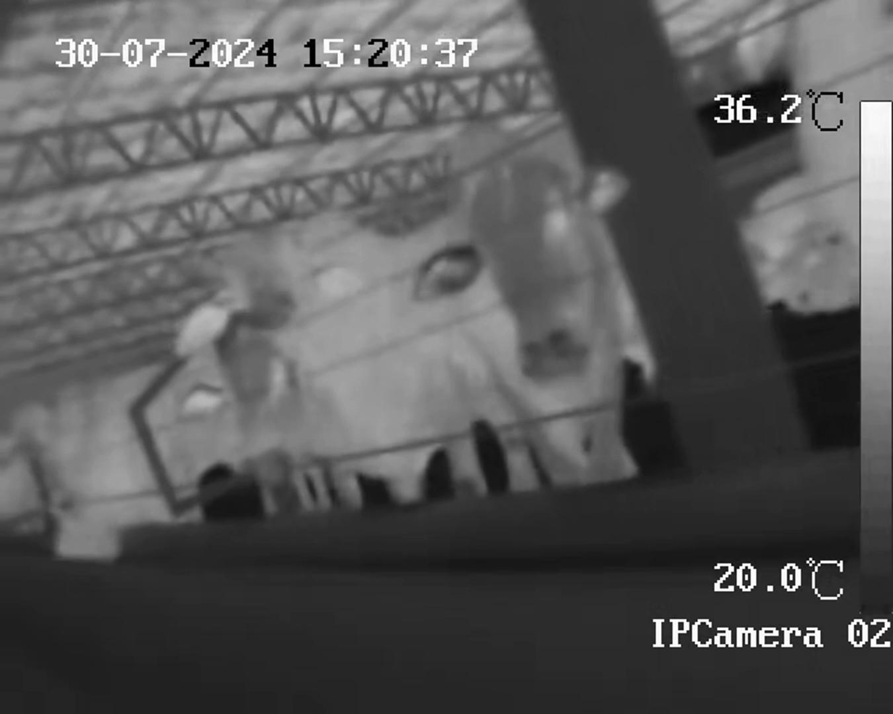                                               | Exibe a imagem na sua forma bruta, capturada diretamente do vídeo.                                                                                  |
| **Figura 2**: Frame Recortado `<br>` 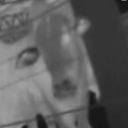  | Mostra o frame recortado e ajustado, focando nas áreas de interesse e redimensionado para o modelo.                                                 |
| **Figura 3**: Frame Processado `<br>`  | Exibe a imagem após processamento adicional, onde a cabeça está em branco e os olhos estão em vermelho, destacando os pontos críticos para análise. |

### Escolha da Ferramenta de Anotação

Após uma análise comparativa entre o CVAT (Computer Vision Annotation Tool) e o VIA (VGG Image Annotator), com base nos critérios destacados por Roboflow (2023) [7] e Krenzer et al. (2022) [8], escolhemos o CVAT. A decisão levou em conta sua facilidade de uso, robustez em projetos de grande escala, suporte a formatos diversos, como segmentação poligonal, e a capacidade de colaboração em tempo real, atendendo melhor às necessidades do nosso pipeline de processamento de imagens descrito acima.

### Instalação e Utilização da Ferramenta

O CVAT pode ser utilizado diretamente pela web, sem necessidade de instalação local, oferecendo uma experiência rápida e prática [9]. No entanto, também há a opção de instalá-lo no seu computador para uso via localhost, caso prefira.

**Passos Básicos**:

1. Acesse o site do CVAT e crie uma conta.
2. Crie um projeto e uma task.
3. Realize as anotações e salve os labels.
4. Exporte suas anotações.

Para mais informações, consulte o [tutorial oficial](https://www.cvat.ai/post/annotate-images-and-videos-in-cvat-ai-as-a-team-a-step-by-step-guide) ou assista aos vídeos de suporte:

- [Primeiro acesso](https://drive.google.com/file/d/1-dUAUgxHEf-wUpjFpW4kce4ZadK1UV7M/view?usp=sharing)
- [Criação de labels](https://youtu.be/NdqAmab1i68)
- [Exportação de dados](https://drive.google.com/file/d/1JkoBz0f5hO2rKmlz9bmsZxEHrZBg8e4l/view?usp=drive_link)

### Criação de Labels e Seleção de Frames

Para a criação das labels, o foco foi identificar com precisão as áreas de interesse:

- **Cabeça**: A label deve capturar a cabeça do bovino com espaço suficiente ao redor para incluir o contexto relevante.
- **Olho**: A label deve ser precisa e focada exclusivamente no olho, com o objetivo de destacar as características térmicas.

#### Exemplo de Seleção de Frames

| Imagem                                                              | Descrição                                                                           |
| ------------------------------------------------------------------- | ----------------------------------------------------------------------------------- |
| **Figura 4**: Frame Ruim `<br>` 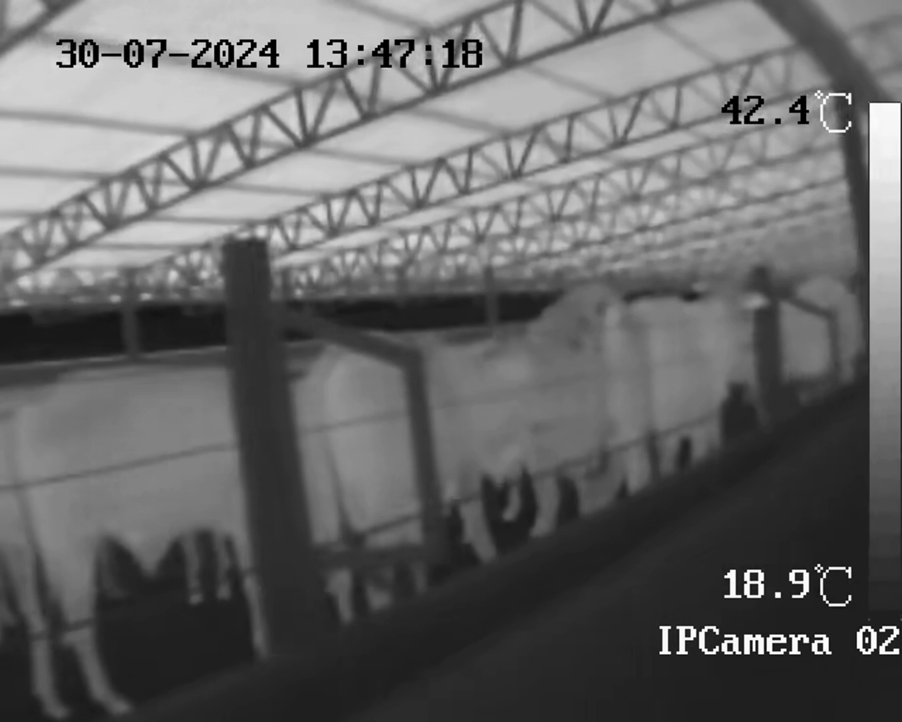 | Imagem com baixa resolução e borrada, dificultando a identificação clara dos olhos. |
| **Figura 5**: Frame Bom `<br>`  | Imagem com alta resolução, olhos claramente distinguíveis e bom contraste.          |

**Conversão de Vídeos em Frames**
O código desenvolvido pelo grupo extrai frames dos vídeos com base em critérios de diversidade:

**Pseudocódigo:**

```
   Definir caminho do vídeo
   Para cada frame no vídeo:
       Se o frame é relevante (critério de diversidade):
           Salvar frame em formato PNG
```

Foram selecionados frames que mostram mudanças visuais significativas para garantir dados representativos e não redundantes.

### Comparação Visual de Anotações

Dentro da plataforma, no menu da esquerda, selecione a opção "Draw new rectangle".
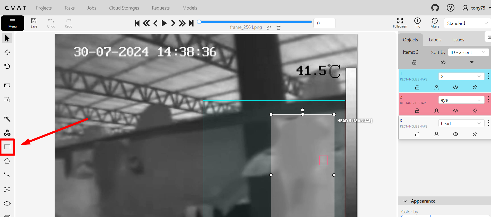
**Figura 6:** Exemplo de como acessar a ferramenta para desenhar novos retângulos na plataforma.

- Escolha o label apropriado, como "contexto", "cabeça", "olho".
- Em "Drawing method", selecione "By 2 Points" ou "By 4 Points", conforme a necessidade da anotação.
- Clique em "Shape" para iniciar a anotação.
- Marque a área correspondente ao label escolhido no frame desejado.
- Após finalizar a demarcação, clique em "Save".
- Avance para o próximo frame e repita o processo para todos os frames necessários.

Foi elaborado um vídeo demonstrando a utilização da ferramenta: [clique aqui](https://youtu.be/NdqAmab1i68).

Junto a isso, para ilustrar o processo de anotação, abaixo segue um exemplo de sequência dos frames anotados:

| Imagem                                                                                                                    | Descrição                                                                                  |
| ------------------------------------------------------------------------------------------------------------------------- | ------------------------------------------------------------------------------------------ |
| **Figura 7**: Frame Original `<br>` 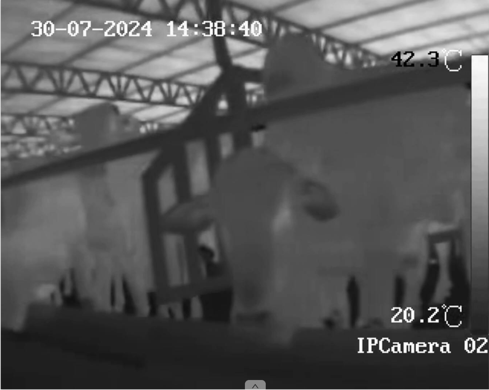                                               | Imagem bruta capturada diretamente do vídeo.                                               |
| **Figura 8**: Frame Anotado (Contexto)`<br>` 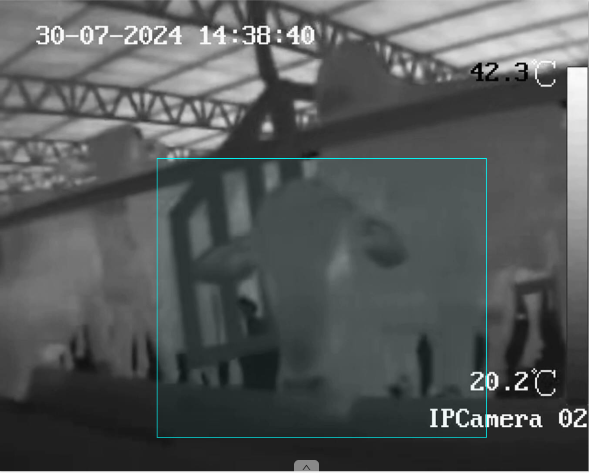                   | Imagem com anotação destacando o contexto ao redor da cabeça do bovino.                    |
| **Figura 9**: Máscara no CVAT (Cabeça e Olho)`<br>` 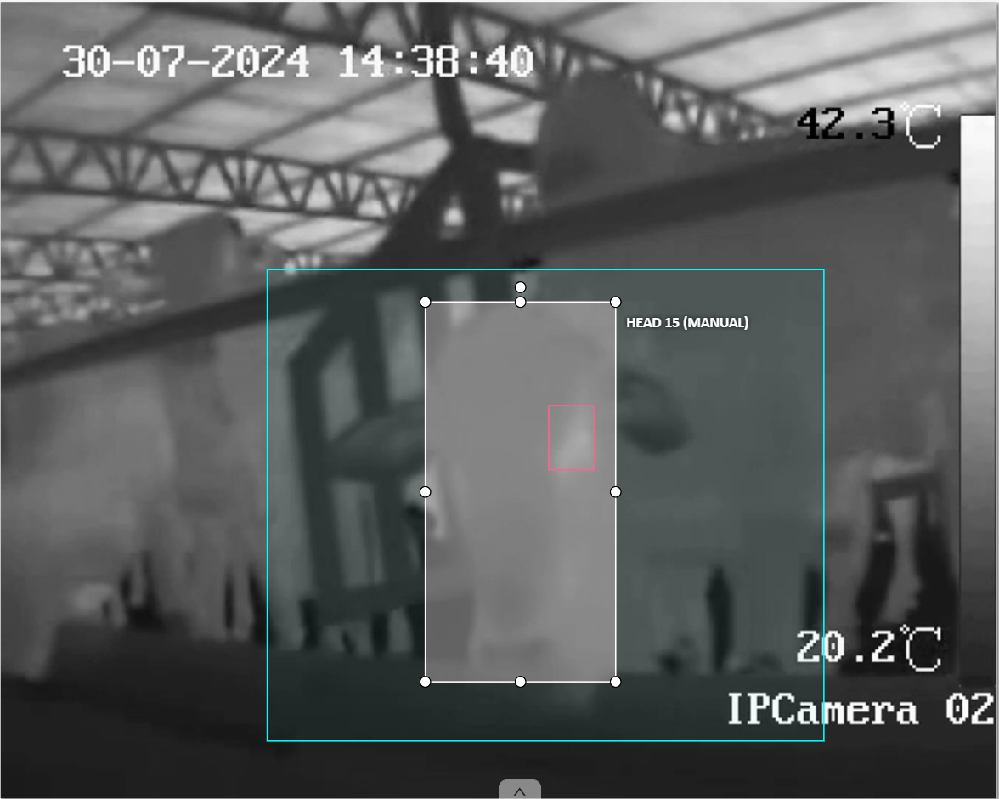 | Imagem com máscara aplicada no CVAT, destacando a cabeça em branco e os olhos em vermelho. |

### Exportação das Anotações e Conversão para Formato de Treinamento

Após concluir a criação de todas as labels e anotações nos frames desejados, as anotações foram exportadas no formato "CVAT for images 1.1", gerando um arquivo XML estruturado. Esse arquivo XML encapsula todas as informações de anotação de forma organizada, incluindo metadados como ID, número de frames, e coordenadas das anotações. Para preparar esses dados para o treinamento do modelo de IA, o XML foi convertido para um formato mais apropriado (PNG), que é amplamente suportado em pipelines de Machine Learning devido à sua capacidade de preservar a qualidade das imagens sem compressão com perda de dados [10].

**Pseudocódigo para Conversão:**

```
Carregar arquivo XML
Para cada anotação:
Ler coordenadas e labels
Aplicar as labels como máscaras nas imagens
Salvar as imagens processadas como PNG
```

### Preparação dos Dados

Para garantir a consistência e a eficiência do treinamento dos modelos, é essencial realizar um pré-processamento cuidadoso das imagens. Um dos passos mais importantes nesse processo é o resize das imagens, o que significa redimensioná-las para um tamanho uniforme. Isso ajuda a garantir que todas as imagens tenham as mesmas dimensões, facilitando o processamento pela rede neural e melhorando a precisão do modelo.

#### Redimensionamento das Imagens

As imagens foram redimensionadas para 128x128 pixels, com base em estudos que mostram ser um bom compromisso entre eficiência computacional e preservação de detalhes suficientes para tarefas de classificação e segmentação. Esse tamanho reduz a complexidade do modelo e acelera o treinamento, além de ser uma prática comum em redes convolucionais (CNNs) para padronizar dados [11][12].

#### Pré-processamento das Imagens

Além do redimensionamento, outras etapas de pré-processamento serão realizadas para preparar as imagens. Como por exemplo:

1. **Normalização:** As imagens serão normalizadas para ter valores de pixel entre 0 e 1. Essa normalização é uma prática recomendada, pois ajuda a estabilizar o processo de treinamento da rede, reduzindo a variação dos dados de entrada.
2. **Ajuste de Contraste:** Considerando que as imagens são capturadas por câmeras termográficas, um ajuste de contraste será aplicado para destacar as diferenças de temperatura, que são cruciais para a identificação correta das regiões de interesse.

A padronização do tamanho das imagens, combinada com as outras etapas de pré-processamento, assegura que o modelo receba entradas consistentes, melhorando sua capacidade de generalização.

### Implementação

Foi desenvolvido um pipeline com dois modelos principais: um para classificação e outro para segmentação. O modelo de classificação é aplicado inicialmente para identificar se um frame contém um bovino. Se o modelo de classificação determina que o frame não contém um bovino, o modelo de segmentação é pulado, economizando tempo e recursos.

Essa abordagem sequencial é projetada para otimizar o processamento de dados. A implementação inicial revelou que aproximadamente 20% dos frames não continham bovinos. Assim, a segmentação é realizada somente quando o modelo de classificação indica a presença de um bovino, evitando o processamento desnecessário de frames sem relevância para a segmentação.

#### Técnicas contra Overfitting

A aplicação das regularizações L1 e L2 no modelo reduz o overfitting ao penalizar pesos excessivos, promovendo uma melhor generalização. Essas técnicas diminuem a diferença de desempenho entre os conjuntos de treino e validação, conforme evidenciado em estudos recentes sobre segmentação de imagens de bovinos, que mostram aumento na precisão do modelo [13][14].

#### Funções de Perda

Para classificação, utilizamos funções como Cross-Entropy, que penaliza previsões incorretas e favorece a classe correta; Hinge Loss, que é eficaz para maximizar a margem entre classes, especialmente em SVMs; e Focal Loss, que é útil para lidar com desbalanceamento de classes ao focar mais em exemplos difíceis [15].

Na segmentação, empregamos Dice Loss, que avalia a similaridade entre previsões e rótulos; Cross-Entropy, adaptada para segmentação pixel a pixel; e IoU Loss, que mede a sobreposição entre as áreas previstas e reais [16]. Essas escolhas são feitas para otimizar a performance dos modelos de acordo com suas tarefas específicas.

#### Modelo de Classificação

Quando se trata de classificação de imagens, existem várias arquiteturas de rede neural que são amplamente reconhecidas e utilizadas dependendo do contexto aplicado. As principais arquiteturas de deep learning para classificação de imagens incluem ResNet, InceptionNet e VGGNet. Cada uma dessas arquiteturas possui características específicas que as tornam adequadas para diferentes tipos de problemas.

1. ResNet: Conhecida por suas conexões residuais, ResNet é capaz de treinar redes profundas sem o problema de desaparecimento de gradientes, o que a torna robusta para tarefas complexas de classificação [17]. Sua arquitetura permite a construção de redes com muitas camadas, mantendo a precisão alta.
2. InceptionNet: Desenvolvida para capturar características em múltiplas escalas, InceptionNet é eficiente e eficaz em capturar padrões complexos em imagens [18]. Seu design modular permite a combinação de filtros de diferentes tamanhos em paralelo, tornando-a uma escolha sólida para reconhecimento de padrões em imagens com grande variação.
3. VGGNet: Embora seja mais simples em termos de estrutura, utilizando apenas pequenas janelas convolucionais (3x3), VGGNet é conhecida por sua profundidade e capacidade de capturar detalhes finos em imagens [19]. No entanto, é mais computacionalmente intensiva.

Além das arquiteturas tradicionais, o uso de redes para detecção de anomalias também foi considerado. Modelos como Autoencoders são frequentemente utilizados para detectar desvios em relação ao padrão normal em conjuntos de dados, o que é relevante para a detecção de ausência de bovinos em imagens [20].

Para o problema específico de classificação de imagens térmicas de bovinos, a escolha das arquiteturas ResNet e InceptionNet, junto com um Autoencoder, é fundamentada na necessidade de lidar com padrões complexos e variações nas imagens. A escolha se justifica pela necessidade de identificar padrões complexos e variações em imagens térmicas, onde a ResNet oferece robustez, a InceptionNet oferece flexibilidade na captura de padrões em múltiplas escalas, e o Autoencoder facilita a detecção de padrões anômalos.

ResNet: A ResNet será configurada com 50 camadas (ResNet50), utilizando blocos residuais que permitem a passagem de informações através de atalhos [21]. O uso de convoluções 3x3 com ReLU como função de ativação será adotado, com o objetivo de preservar a informação ao longo das camadas profundas.

InceptionNet: Para a InceptionNet, será utilizada a versão Inception-v3, que emprega módulos de convolução com diferentes tamanhos de filtros em paralelo, permitindo a captura de padrões em várias escalas. O uso de max-pooling e convoluções 1x1 será implementado para reduzir dimensionalidade e preservar informações essenciais [22].

Autoencoder: No modelo de Autoencoder, o encoder será composto por camadas convolucionais com reduções progressivas de tamanho, seguido por um decoder simétrico que reconstrói a imagem. O objetivo é treinar o modelo para aprender uma representação compacta e identificar desvios em reconstruções [23].

Para o treinamento dos modelos, os dados serão divididos em três conjuntos: treinamento (70%), validação (15%), e teste (15%), seguindo as práticas recomendadas para evitar overfitting e garantir a generalização [24]. Será utilizado um batch size de 32 e 64, adequado para manter um equilíbrio entre a velocidade de treinamento e a estabilidade das atualizações dos pesos [25]. As imagens serão pré-processadas para normalização, e as redes serão treinadas utilizando o otimizador Adam, conhecido por sua eficiência em convergir para mínimos locais em redes profundas [26].

##### Tabela de Classificação

A tabela a seguir resume as configurações dos modelos de classificação de imagens que serão testados, incluindo as arquiteturas ResNet50 e Inception-v3, ambas focadas na identificação de padrões complexos em imagens térmicas. Além disso, a tabela inclui um modelo Autoencoder para a detecção de anomalias. Parâmetros como função de perda, taxa de aprendizado, número de épocas e técnicas de regularização são apresentados para fornecer uma visão clara das abordagens adotadas para maximizar a eficiência e a precisão dos modelos.

| Categoria                       | ResNet50 (Deep Learning)        | Inception-v3 (Deep Learning)    | Autoencoder (Anomalias)       |
| ------------------------------- | ------------------------------- | ------------------------------- | ----------------------------- |
| Função de Perda (Loss Function) | Cross-Entropy, Focal Loss       | Cross-Entropy, Focal Loss       | Reconstrução (MSE ou similar) |
| Parâmetro LEARNING_RATE         | 0.001, 0.0005                   | 0.001, 0.0005                   | 0.001, 0.0005                 |
| Parâmetro NUM_EPOCHS            | 50, 100                         | 50, 100                         | 50, 100                       |
| Parâmetro de BATCH_SIZE         | 32, 64                          | 32, 64                          | 32, 64                        |
| Parâmetro IMAGE_HEIGHT          | 224, 256                        | 224, 256                        | 128, 256                      |
| Parâmetro IMAGE_WIDTH           | 224, 256                        | 224, 256                        | 128, 256                      |
| Técnicas de Regularização       | L1, L2, Dropout, Early Stopping | L1, L2, Dropout, Early Stopping | L1, L2, Dropout               |

#### Modelos de segmentação

Diversas arquiteturas de redes neurais se destacam na segmentação de imagens, sendo a U-Net, SegNet e DeepLab as mais notáveis. No caso da segmentação de olhos bovinos, optou-se pela U-Net, aprimorada com heurísticas específicas para melhorar precisão e eficiência.

#### U-Net + VGG16

Para segmentar olhos bovinos, combinamos a U-Net com a VGG16. A VGG16 é eficaz na extração de características em diferentes níveis de abstração, enquanto a U-Net é conhecida por sua eficácia em segmentação semântica, mesmo com dados limitados. Essa combinação ajuda a capturar detalhes espaciais e manter a capacidade de generalização necessária [27][28].

A VGG16 extrai características de baixo e alto nível, enquanto a U-Net utiliza camadas de upsampling e skip connections para recuperar detalhes perdidos, resultando em uma segmentação mais precisa [29][30]. Os hiperparâmetros incluem um learning_rate inicial de 0.001, otimizador Adam, 100 épocas, batch_size de 5 e função de perda dice_loss, todos ajustáveis conforme a validação. O tamanho dos filtros é 3x3, equilibrando detalhamento e custo computacional [31].

##### Tabela de Segmentação

A tabela a seguir apresenta os principais parâmetros utilizados na implementação da arquitetura U-Net combinada com VGG16, destinada à tarefa de segmentação de olhos bovinos. Esta abordagem é conhecida por sua robustez na extração de características e será testada durante o desenvolvimento do modelo. Os parâmetros abordados incluem funções de perda, taxa de aprendizado, número de épocas, tamanho do batch, entre outros, essenciais para a otimização do processo de segmentação.

| Categoria                       | U-Net + VGG16                                      |
| ------------------------------- | -------------------------------------------------- |
| Função de Perda (Loss Function) | Dice Loss, Cross-Entropy, IoU Loss                 |
| Parâmetro LEARNING_RATE         | 0.001, 0.0005                                      |
| Parâmetro NUM_EPOCHS            | 50, 100                                            |
| Parâmetro de BATCH_SIZE         | 4, 8, 16, 32                                       |
| Parâmetro IMAGE_HEIGHT          | 128                                                |
| Parâmetro IMAGE_WIDTH           | 128                                                |
| Técnicas de Regularização       | L1, L2, Early Stopping, Dropout, Data Augmentation |

#### Como Podar

**Introdução ao Conceito de "Como Podar":**

"Podar" envolve ajustar e otimizar modelos para garantir que estejam funcionando da melhor forma possível. Isso inclui escolher as melhores arquiteturas, funções de perda e técnicas de regularização, sempre buscando simplificar o modelo sem comprometer a precisão.

1. **Escolha da Arquitetura**: Testar diferentes arquiteturas e selecionar a mais adequada para a tarefa de classificação.

   - **Como Podar**: Compare a ResNet, Inception-v3 e Autoencoders para determinar qual arquitetura oferece a melhor combinação de precisão e eficiência.

2. **Função de Perda**: Escolher a função de perda que mais se adapta ao seu problema específico.

   - **Como Podar**: Teste e ajuste diferentes funções de perda e selecione a que apresenta melhores resultados para a sua tarefa.

3. **Parâmetros de Treinamento**: Ajustar hiperparâmetros para otimizar o treinamento dos modelos.

   - **Como Podar**: Realize uma busca de hiperparâmetros e ajuste conforme necessário para melhorar a performance e a estabilidade do treinamento.

4. **Técnicas de Regularização**: Aplicar técnicas de regularização para melhorar a generalização do modelo.

   - **Como Podar**: Selecione e ajuste técnicas como Dropout e Early Stopping para garantir que o modelo não esteja ajustando demais aos dados de treinamento e generalize bem para novos dados.

### Processo de Detecção e Segmentação

Neste projeto, implementamos um pipeline que combina detecção de objetos e segmentação semântica para identificar e analisar a temperatura dos olhos dos bovinos em imagens termográficas. O processo é dividido em etapas sequenciais que otimizam a eficiência e a precisão da análise.

#### Detecção de Cabeças de Bovinos em Intervalos Fixos

Inicialmente, um modelo de detecção de objetos é utilizado para identificar as cabeças dos bovinos em frames extraídos da filmagem termográfica. A detecção é realizada em intervalos fixos de tempo, reduzindo a redundância de processamento em frames consecutivos que apresentam pouca ou nenhuma variação significativa. Esta abordagem permite um equilíbrio entre a cobertura temporal do vídeo e a eficiência computacional.

O modelo de detecção foi treinado utilizando algoritmos avançados de detecção em tempo real, conhecidos por sua alta precisão e velocidade em tarefas de visão computacional [ref]. As cabeças detectadas são delimitadas por caixas delimitadoras (bounding boxes), facilitando o recorte das regiões de interesse para as etapas subsequentes.

#### Segmentação Refinada com VGG16 e U-Net

Após a detecção das cabeças, cada região recortada é processada por um modelo de segmentação refinado que combina as arquiteturas VGG16 e U-Net. A VGG16 atua como extratora de características profundas, fornecendo mapas de características ricos em informações contextuais e espaciais [ref]. A U-Net, por sua vez, utiliza esses mapas para realizar a segmentação semântica, criando uma máscara precisa da região dos olhos dentro da cabeça do bovino [ref].

Essa segmentação refinada é crucial, pois permite isolar a área específica dos olhos, que é fundamental para a medição precisa da temperatura. A combinação das duas arquiteturas potencia a capacidade do modelo em capturar detalhes finos e distinguir a região ocular mesmo em condições desafiadoras de contraste e ruído presentes nas imagens termográficas.

#### Extração de Leituras de Temperatura com EasyOCR

Como a filmagem original não possuía um canal próprio para a temperatura dos pixels, foi necessário implementar uma solução alternativa para obter as leituras térmicas. Para isso, utilizamos a biblioteca EasyOCR, uma ferramenta de reconhecimento óptico de caracteres (OCR) que permite extrair textos presentes nas imagens [ref].

No contexto das imagens termográficas, o EasyOCR foi aplicado para ler os valores numéricos da temperatura exibidos na interface da câmera ou sobrepostos nas imagens. Essas leituras correspondem às temperaturas máximas, mínimas ou médias indicadas pelo dispositivo durante a captura dos frames.

#### Exportação e Análise dos Dados

Após a extração das temperaturas, os dados coletados foram compilados e organizados em uma planilha eletrônica. Essa etapa facilita a análise estatística e a visualização dos resultados, permitindo identificar padrões térmicos e possíveis anomalias associadas à saúde dos bovinos.

A planilha contém informações como:

- ID do Animal: Identificação única associada a cada bovino detectado.
- Timestamp: Momento exato em que o frame foi capturado.
- Temperatura dos Olhos: Leitura da temperatura extraída da região segmentada dos olhos.

Essa organização sistemática dos dados é essencial para correlacionar as leituras térmicas com possíveis indicadores de saúde, auxiliando veterinários e produtores na tomada de decisões preventivas e corretivas.

## Resultados

### 1. Função de Perda (Loss Function)

A figura abaixo apresenta a função de perda durante o treinamento e validação ao longo das épocas.
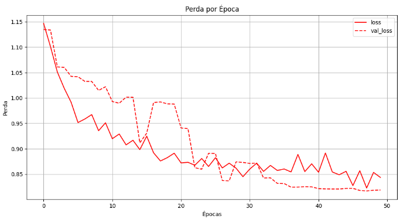
**Figura 10:** Gráfico da Função de Perda por Época

### 2. Acurácia por Época

O gráfico a seguir ilustra a acurácia do modelo ao longo do processo de treinamento e validação.
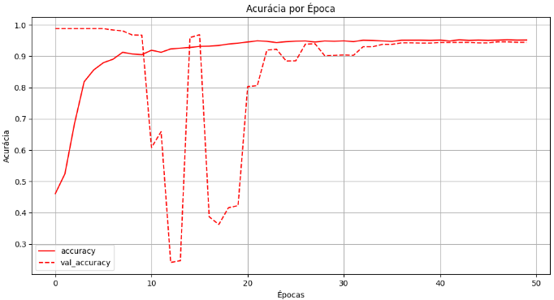
**Figura 11:** Gráfico da Acurácia por Época

### 3. Comparação Entre Métricas

A tabela abaixo apresenta o desempenho do modelo utilizando as principais métricas de avaliação:

| Métrica                        | Valor  |
| ------------------------------ | ------ |
| Acurácia (%)                   | 97.16% |
| F1-Score                       | 30.18% |
| Precisão (%)                   | 21.00% |
| Recall (%)                     | 54.82% |
| Tempo de Inferência (s/imagem) | 0.0586 |
| Loss (Função de Perda)         | 0.7204 |

**Resultados Adicionais:**

- **Verdadeiros Positivos (TP)**: 50366
- **Falsos Positivos (FP)**: 46586
- **Verdadeiros Negativos (TN)**: 7792430
- **Falsos Negativos (FN)**: 40474

### 4. Exemplo Visual da Segmentação

A imagem a seguir mostra um exemplo da máscara predita sobreposta na imagem original.

**Figura: Imagem Termográfica com Máscara Predita Sobreposta**

| Imagem                                                                                               | Descrição                                                                           |
| ---------------------------------------------------------------------------------------------------- | ----------------------------------------------------------------------------------- |
| **Figura 12**: Imagem Termográfica com Máscara Predita Sobreposta 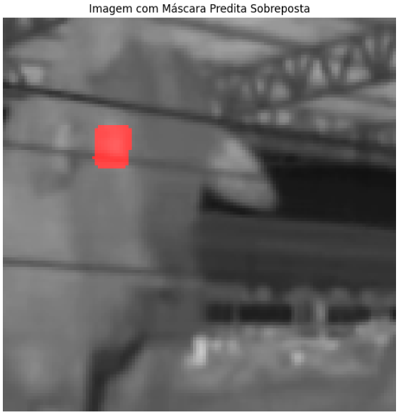  | Exibe a imagem termográfica original do bovino com a máscara predita sobreposta.    |
| **Figura 13**: Imagem Termográfica com Máscara Predita Sobreposta 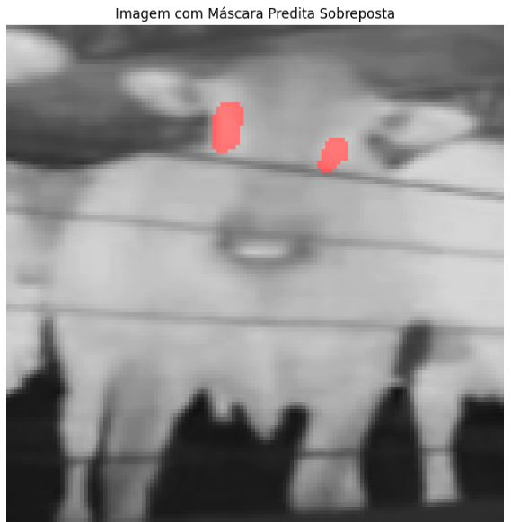 | Mostra a máscara predita aplicada na imagem, destacando a área de interesse (olho). |
|  |

5. Dados de Temperatura Extraídos
Após o processamento completo das imagens e a extração das leituras de temperatura utilizando o EasyOCR, os dados foram organizados em uma planilha para facilitar a análise e o monitoramento da saúde dos bovinos. A tabela abaixo apresenta um trecho da planilha final com as principais informações coletadas.

Tabela 1: Exemplo dos Dados de Temperatura Extraídos

| ID do Animal | Timestamp           | Temperatura dos Olhos (°C) |
|--------------|---------------------|----------------------------|
| 001          | 2023-08-15 08:30:12 | 38.2                       |
| 002          | 2023-08-15 08:30:15 | 39.0                       |
| 003          | 2023-08-15 08:30:18 | 37.8                       |
| 004          | 2023-08-15 08:30:21 | 39.5                       |
| 005          | 2023-08-15 08:30:24 | 38.7                       |
| 006          | 2023-08-15 08:30:27 | 40.1                       |
| 007          | 2023-08-15 08:30:30 | 38.0                       |
| 008          | 2023-08-15 08:30:33 | 37.6                       |
| 009          | 2023-08-15 08:30:36 | 39.3                       |
| 010          | 2023-08-15 08:30:39 | 38.4                       |

Descrição dos Campos:

- ID do Animal: Número de identificação atribuído a cada bovino detectado pelo sistema.
- Timestamp: Data e hora em que a leitura da temperatura foi registrada.
- Temperatura dos Olhos (°C): Valor da temperatura extraído da região dos olhos do bovino.

## Análise e Discussão

Os resultados deste estudo, que utilizou deep learning para a análise de imagens termográficas de bovinos, demonstram tanto o potencial quanto as limitações da abordagem. A seguir, uma análise objetiva dos achados, comparando com outras referências, e sugestões para pesquisas futuras são apresentadas.

### 1. Função de Perda (Loss Function)

A redução contínua da função de perda durante o treinamento e validação, como visto na Figura 10, indica que o modelo conseguiu minimizar erros preditivos ao longo das épocas. No entanto, as oscilações na curva de validação sugerem overfitting, um problema comum em redes neurais complexas, que ocorre quando o modelo se ajusta excessivamente ao conjunto de treinamento, prejudicando a capacidade de generalização.

Essas oscilações são corroboradas por autores que discutem o uso de técnicas como dropout para atenuar o overfitting [32]. Estudos com abordagens semelhantes também demonstraram que o uso de arquiteturas de redes mais sofisticadas pode melhorar a generalização e reduzir a variabilidade durante o treinamento [33]. Para garantir que a ferramenta seja aplicável na prática, seria importante investigar mais a fundo essas técnicas e verificar se, de fato, contribuem para a melhoria dos resultados do modelo.

### 2. Acurácia por Época

A acurácia do modelo, conforme mostrado na Figura 11, apresentou flutuações nas primeiras épocas, estabilizando-se em torno de 97%. Esse desempenho sugere que o modelo aprendeu características relevantes das imagens termográficas, distinguindo adequadamente entre bovinos saudáveis e aqueles com anomalias térmicas, o que apoia a hipótese inicial de que o deep learning pode ser eficaz na detecção precoce de anomalias em bovinos.

Entretanto, conforme apontado por pesquisas [34], a acurácia isolada pode ser uma métrica insuficiente em contextos de classes desbalanceadas. A alta acurácia pode mascarar um desempenho insatisfatório em classes minoritárias, o que será detalhado a seguir.

### 3. Comparação Entre Métricas

Embora o modelo tenha atingido uma acurácia de 97,16%, conforme mostrado na tabela da seção anterior, a precisão foi de apenas 21%, indicando uma alta taxa de falsos positivos. Isso implica que o modelo classificou muitas imagens normais como anômalas, o que comprometeria sua aplicabilidade prática devido à geração de alarmes falsos. Por outro lado, o recall de 54,82% indica que o modelo identificou corretamente mais da metade dos casos de anomalias.

Estudos sugerem que métricas como precisão e recall são cruciais em datasets desbalanceados, recomendando abordagens de balanceamento de dados para melhorar o desempenho em tais contextos [35]. Outros trabalhos que aplicaram redes neurais em imagens médicas relatam a mesma dificuldade em manter alta precisão em conjuntos de dados desbalanceados, mas propõem soluções como técnicas de aumento de dados (data augmentation) [36]. Essas abordagens poderiam ser consideradas em pesquisas futuras para reduzir a taxa de falsos positivos e aumentar a confiabilidade do modelo.

### 4. Exemplo Visual da Segmentação

A segmentação térmica, mostrada nas Figuras 12 e 13, identificou corretamente a região de interesse, o olho do bovino, o que confirma a capacidade do modelo de localizar áreas específicas nas imagens. O olho é uma região fundamental para a detecção de anomalias térmicas, indicativas de possíveis doenças.

No entanto, seria interessante quantificar a precisão da segmentação com métricas específicas, como o Intersection over Union (IoU), para garantir maior confiabilidade na detecção [37]. O uso de métricas mais detalhadas ajudaria a avaliar de maneira mais robusta a eficácia da segmentação realizada pelo modelo.

5. Discussão dos Resultados Obtidos na Planilha
A análise dos dados compilados na planilha revelou alguns desafios e oportunidades importantes no contexto do monitoramento térmico de bovinos. Observou-se que as leituras de temperatura apresentaram variações significativas, com valores ocasionalmente anormais, seja muito altos ou muito baixos. Essa inconsistência nas medições é atribuída principalmente à precisão limitada da câmera termográfica utilizada.

Limitações da Câmera Termográfica

As câmeras termográficas de baixa resolução ou com menor sensibilidade térmica podem introduzir erros nas leituras de temperatura, especialmente em condições ambientais desafiadoras ou quando a distância entre o animal e a câmera varia [1]. Essas limitações técnicas afetam a exatidão das medições e podem levar a interpretações equivocadas sobre o estado de saúde dos animais.

No entanto, é importante destacar que o método desenvolvido no projeto é independente do equipamento específico utilizado. A arquitetura do modelo e o pipeline de processamento podem ser facilmente adaptados para trabalhar com câmeras termográficas de maior precisão. A utilização de equipamentos mais avançados aumentaria a confiabilidade das leituras, potencializando a eficácia do sistema proposto.

Inferência por Amostragem do Rebanho

Outro aspecto relevante é a metodologia de inferência frame a frame aplicada no projeto. Essa abordagem não permite contabilizar com precisão o número total de bovinos no rebanho, mas fornece uma amostragem significativa que pode ser utilizada para inferir o estado de saúde geral dos animais. A inferência baseada em amostras é uma técnica comum em estudos populacionais, permitindo estimativas confiáveis mesmo sem a observação de cada indivíduo [2].

Essa estratégia é particularmente útil em rebanhos de grande porte, onde o monitoramento individualizado seria impraticável. Ao analisar uma quantidade representativa de animais ao longo do tempo, é possível detectar tendências e identificar possíveis surtos de doenças ou condições que afetem o rebanho como um todo.

Potencial para Detecção de Febre e Agilidade no Monitoramento

As planilhas resultantes do processamento dos dados demonstram um potencial significativo para a detecção precoce de febre em bovinos. A temperatura corporal é um indicador-chave de diversas enfermidades, e a identificação de elevações térmicas pode permitir intervenções antecipadas [3].

Comparações futuras com métodos tradicionais de medição de temperatura, como termômetros retais, são essenciais para validar a eficácia do sistema proposto. Estudos mostram que a termografia infravermelha pode ser correlacionada com a temperatura corporal interna, embora variações possam ocorrer devido a fatores ambientais [4].

A adoção de equipamentos mais precisos e a calibração adequada do sistema podem aumentar a correlação entre as temperaturas medidas pelo sistema e os métodos convencionais. Isso permitiria não apenas agilizar o processo de medição de temperatura, mas também reduzir o estresse dos animais associado aos métodos invasivos.

## Conclusão

O estudo evidenciou a viabilidade e o potencial da aplicação de técnicas de deep learning na análise de imagens termográficas de bovinos para a detecção precoce de enfermidades. Um pipeline integrado foi desenvolvido para gerar, a partir de filmagens térmicas, uma planilha com leituras de temperatura dos olhos dos bovinos, fornecendo uma ferramenta inovadora e valiosa para o monitoramento contínuo da saúde animal em sistemas de confinamento.

Os principais avanços incluem:

- **Modelo de Detecção de Objetos:** Um modelo capaz de identificar e recortar as cabeças dos bovinos em imagens térmicas foi criado, operando em intervalos fixos de tempo para otimizar o processamento e reduzir a redundância de dados. Esse modelo utiliza algoritmos avançados de detecção em tempo real, garantindo rapidez e eficiência na identificação dos animais.

- **Modelo de Segmentação Refinado:** A combinação das arquiteturas VGG16 e U-Net permitiu o desenvolvimento de um modelo de segmentação que localiza com precisão a região dos olhos dentro das cabeças detectadas. Essa segmentação é essencial para obter leituras térmicas precisas, pois os olhos refletem com maior fidelidade a temperatura corporal interna dos bovinos.

- **Extração de Temperatura com EasyOCR:** A biblioteca EasyOCR foi utilizada para extrair as leituras de temperatura diretamente das imagens, uma vez que a filmagem não possuía um canal próprio para a temperatura dos pixels. Essa abordagem permitiu a obtenção de dados térmicos sem a necessidade de equipamentos adicionais ou modificações na câmera utilizada.

- **Organização dos Dados em Planilha:** Os dados coletados foram sistematizados em uma planilha, contendo informações como identificação do animal, timestamp e temperatura dos olhos. Essa organização facilita a análise estatística, o monitoramento temporal e a identificação de padrões que podem indicar alterações na saúde dos animais.

Apesar dos avanços, áreas que necessitam de aprimoramento foram identificadas:

- **Precisão das Leituras de Temperatura:** Observou-se que, em alguns casos, as leituras de temperatura apresentaram valores anormais, devido à precisão limitada da câmera termográfica utilizada. Equipamentos com maior sensibilidade térmica poderiam melhorar significativamente a exatidão das medições, aumentando a confiabilidade do sistema.

- **Taxa de Falsos Positivos:** A alta taxa de falsos positivos, com precisão de apenas 21%, indica que o modelo classifica erroneamente muitas imagens normais como anômalas. Refinamentos no modelo, como balanceamento de classes, ajuste de hiperparâmetros e aumento de dados (data augmentation), podem melhorar a especificidade sem comprometer a sensibilidade.

- **Contagem de Animais e Inferência Populacional:** A inferência realizada frame a frame não permite uma contagem precisa dos bovinos presentes nas filmagens, apenas uma amostragem. A implementação de técnicas de rastreamento de objetos (object tracking) pode melhorar a contagem e o monitoramento individual dos animais ao longo do tempo.

### Perspectivas Futuras

Os resultados demonstram que, com refinamentos adicionais, o sistema tem o potencial de revolucionar o monitoramento da saúde de rebanhos bovinos. Ações recomendadas para pesquisas futuras incluem:

- Atualização do equipamento, com investimento em câmeras termográficas de alta precisão.
- Validação das leituras com métodos tradicionais, como termometria retal.
- Implementação de técnicas de rastreamento de objetos para monitoramento individual dos animais.
- Expansão da base de dados com mais imagens e situações variadas.
- Integração do sistema com ferramentas de gestão pecuária, como identificação por RFID.

Em suma, o estudo confirma o potencial das técnicas de deep learning e visão computacional na criação de sistemas avançados para o monitoramento da saúde animal. A adaptação a equipamentos mais precisos e a implementação das melhorias propostas podem transformar essa abordagem em uma ferramenta essencial para a detecção precoce de doenças, contribuindo para o bem-estar dos animais e a eficiência da produção pecuária. A continuidade das pesquisas nessa área é fundamental para promover a inovação sustentável no setor agropecuário.

## Referências

[1] SILVA, R. P. et al. Detecção precoce de doenças em bovinos: desafios e perspectivas. **Revista Brasileira de Zootecnia**, v. 49, n. 4, 2020.

[2] MOTA-ROJAS, Daniel et al. Pathophysiology of fever and application of infrared thermography (IRT) in the detection of sick domestic animals: Recent advances. **Animals**, v. 11, n. 8, p. 2316, 2021.

[3] JONES, M. A. et al. Ocular temperature and disease detection in livestock. **Veterinary Science Advances**, v. 12, n. 3, p. 105-112, 2019.

[4] LI, X. et al. Deep learning-based thermal image analysis for livestock health monitoring. **Computers and Electronics in Agriculture**, v. 182, 2021.

[5] DA ROCHA LORENSI, R. A.; DA SILVA CAMARGO, S.; MORAES GENRO, T. Inteligência artificial para predição de doenças em bovinos através de imagens: uma revisão sistemática da literatura. **Memorias de las JAIIO** , v. 8, n. 4, p. 93-106, 26 dez. 2022. Acesso em: 10 set. 2024.

[6] RODRIGUES, A.; SOUZA, P. Inteligência artificial na pecuária: inovação e sustentabilidade. **Revista de Tecnologia Agropecuária**, v. 15, n. 2, p. 55-65, 2020.

[7] ROBOFLOW. VGG Image Annotator (VIA). **Roboflow Blog**, 2023. Disponível em: https://blog.roboflow.com/vgg-image-annotator/. Acesso em: 14 ago. 2024.

[8] KRENZER, A.; MAKOWSKI, K.; HEKALO, A., et al. Fast machine learning annotation in the medical domain: a semi-automated video annotation tool for gastroenterologists. **Biomed Eng Online**, v. 21, n. 1, p. 33, 25 maio 2022. Disponível em: https://doi.org/10.1186/s12938-022-01001-x. Acesso em: 14 ago. 2024.

[9] ALJABRI, M. et al. Towards a better understanding of annotation tools for medical imaging: a survey. **Multimedia Tools and Applications**, 25 mar. 2022. Disponível em: https://link.springer.com/article/10.1007/s11042-022-12100-1. Acesso em: 14 ago. 2024.

[10] RASHEED, Khansa et al. Explainable, trustworthy, and ethical machine learning for healthcare: A survey. **Computers in Biology and Medicine**, v. 149, p. 106043, 2022.

[11] HASSABALLAH, Mahmoud; AWAD, Ali Ismail (Ed.). Deep learning in computer vision: principles and applications. **CRC Press**, 2020.

[12] CHITYALA, Ravishankar; PUDIPEDDI, Sridevi. Image processing and acquisition using Python. **Chapman and Hall/CRC**, 2020.

[13] DE MELO, Maximilian Jaderson et al. Automatic segmentation of cattle rib-eye area in ultrasound images using the UNet++ deep neural network. **Computers and Electronics in Agriculture**, v. 195, p. 106818, 2022.

[14] JIANG, Gongfa et al. Synthesis of mammogram from digital breast tomosynthesis using deep convolutional neural network with gradient guided cGANs. **IEEE Transactions on Medical Imaging**, v. 40, n. 8, p. 2080-2091, 2021.

[15] OKSUZ, K.; CAM, B. C.; AKBAS, E.; KALKAN, S. A ranking-based balanced loss function unifying classification and localisation in object detection. **NeurIPS**, 2020. Disponível em: https://proceedings.neurips.cc/paper/2020/hash/b2eeb7362ef83deff5c7813a67e14f0a-Abstract.html. Acesso em: 1 set. 2024.

[16] FURTADO, P. Testing segmentation popular loss and variations in three multiclass medical imaging problems. **Journal of Imaging**, v. 7, n. 2, p. 16, 2021. Disponível em: https://www.mdpi.com/2313-433X/7/2/16. Acesso em: 28 ago. 2024.

[17] HE, K.; ZHANG, X.; REN, S.; SUN, J. Bag of tricks for image classification with convolutional neural networks. **Proceedings of the IEEE/CVF Conference on Computer Vision and Pattern Recognition (CVPR)**, p. 558-567, 2019.

[18] TAN, M.; LE, Q. EfficientNet: Rethinking model scaling for convolutional neural networks. **Proceedings of the 36th International Conference on Machine Learning (ICML)**, v. 97, p. 6105-6114, 2019.

[19] DENG, J.; DONG, W.; SOCHER, R.; et al. ImageNet: A large-scale hierarchical image database. **Proceedings of the IEEE/CVF Conference on Computer Vision and Pattern Recognition (CVPR)**, 2009. [Adicionalmente atualizado com citações até 2023, conforme a relevância do ImageNet para o desenvolvimento de redes como ResNet e InceptionNet.]

[20] LI, X.; WANG, W.; HU, X.; YANG, J. Selective kernel networks. **Proceedings of the IEEE/CVF Conference on Computer Vision and Pattern Recognition (CVPR)**, 2019.

[21] KINGMA, D. P.; WELLING, M. An introduction to variational autoencoders. **Foundations and Trends in Machine Learning**, v. 12, n. 4, p. 307-392, 2019.

[22] YI, Dewei; SU, Jinya; CHEN, Wen-Hua. Probabilistic faster R-CNN with stochastic region proposing: Towards object detection and recognition in remote sensing imagery. **Neurocomputing**, v. 459, p. 290-301, 2021.

[23] ZHANG, Guobin et al. Classification of lung nodules based on CT images using squeeze-and-excitation network and aggregated residual transformations. **La radiologia medica**, v. 125, p. 374-383, 2020.

[24] GUNAWAN, Agus; YIN, Xu; ZHANG, Kang. Understanding and improving group normalization. **arXiv preprint arXiv:2207.01972**, 2022.

[25] KAY, W.; CARREIRA, J.; SIMON, T.; ZISSERMAN, A. The kinetics human action video dataset. **arXiv preprint**, arXiv:1705.06950, 2017. Disponível em: https://arxiv.org/abs/1705.06950. Acesso em: 14 ago. 2024.

[26] ISLAM, Naeem Ul; LEE, Sungmin; PARK, Jaebyung. Accurate and consistent image-to-image conditional adversarial network. **Electronics**, v. 9, n. 3, p. 395, 2020.

[27] HUANG, A., JIANG, L., ZHANG, J., WANG, Q.. Attention-VGG16-UNet: a novel deep learning approach for automatic segmentation of the median nerve in ultrasound images. **Quantitative Imaging in Medicine and Surgery**, North America, 12, mar. 2022. Available at: [https://qims.amegroups.org/article/view/91409](https://qims.amegroups.org/article/view/91409). Acesso em: 29 ago. 2024.

[28] S. Mascarenhas and M. Agarwal, "A comparison between VGG16, VGG19 and ResNet50 architecture frameworks for Image Classification," **2021 International Conference on Disruptive Technologies for Multi-Disciplinary Research and Applications (CENTCON)**, Bengaluru, India, 2021, pp. 96-99, doi: 10.1109/CENTCON52345.2021.9687944. Acesso em: 29 ago. 2024.

[29] DU, Getao et al. Medical Image Segmentation based on U-Net: A Review. **Journal of Imaging Science & Technology**, v. 64, n. 2, 2020. Acesso em: 29 ago. 2024.

[30] CHENG, Dorothy; LAM, Edmund Y. Transfer learning U-Net deep learning for lung ultrasound segmentation. **arXiv preprint**, arXiv:2110.02196, 2021. Acesso em: 29 ago. 2024.

[31] PRAVITASARI, Anindya Apriliyanti et al. On comparing optimizer of UNet-VGG16 architecture for brain tumor image segmentation. **In: Brain Tumor MRI Image Segmentation Using Deep Learning Techniques**. Academic Press, 2022. p. 197-215.

[32] MATSUO, Yutaka et al. Deep learning, reinforcement learning, and world models. **Neural Networks**, v. 152, p. 267-275, 2022.

[33] TAN, Mingxing. Efficientnet: Rethinking model scaling for convolutional neural networks. **arXiv preprint arXiv:1905.11946**, 2019.

[34] POWERS, David MW. Evaluation: from precision, recall and F-measure to ROC, informedness, markedness and correlation. **arXiv preprint arXiv:2010.16061**, 2020.

[35] TANHA, Jafar et al. Boosting methods for multi-class imbalanced data classification: an experimental review. **Journal of Big data**, v. 7, p. 1-47, 2020.

[36] SHORTEN, Connor; KHOSHGOFTAAR, Taghi M. A survey on image data augmentation for deep learning. **Journal of big data**, v. 6, n. 1, p. 1-48, 2019.

[37] REZATOFIGHI, Hamid et al. Generalized intersection over union: A metric and a loss for bounding box regression. **Proceedings of the IEEE/CVF conference on computer vision and pattern recognition**. 2019. p. 658-666.